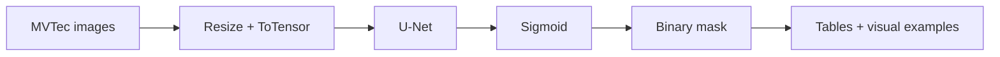

# Conveyor Defect Detection with U-Net

Проект по сегментации дефектов на изображениях деталей конвейера.  
Содержание: одна модель, понятный пайплайн, минимум лишних зависимостей и автоматическое сохранение наглядных результатов.

## Быстрые ссылки

- GitHub-репозиторий: [rvaleev2016-eng/conveyor-defect-detection](https://github.com/rvaleev2016-eng/conveyor-defect-detection)
- Главная витрина в ClearML: одна итоговая задача `Defense Showcase (U-Net)`
- Основные материалы для защиты: `results/final/defense/` и `results/teacher_revision/`

## Цель проекта

Найти дефектные области на изображении и получить **бинарную маску дефекта** с помощью `U-Net`.

## Что делает проект

1. Загружает изображения и маски из `MVTec AD`.
2. Обучает `U-Net` для пиксельной сегментации дефекта.
3. Сохраняет модель, таблицы и графики.
4. Строит визуальные примеры: исходное изображение, истинная маска, предсказанная маска и overlay.
5. Логирует результаты в `ClearML` для удобной демонстрации через веб-интерфейс.
6. Следит за `validation error` и прекращает обучение, если качество на валидации перестаёт улучшаться.

## Архитектура пайплайна



## Структура проекта

| Путь | Назначение |
|---|---|
| `models/unet.py` | Архитектура модели `U-Net` |
| `src/data/segmentation_dataset.py` | Загрузка изображений и масок |
| `src/visualization.py` | Сохранение графиков и визуальных примеров |
| `scripts/train_unet.py` | Обучение модели |
| `scripts/evaluate_unet.py` | Оценка на validation split |
| `scripts/inference_unet.py` | Предсказание масок на новых изображениях |
| `scripts/create_defense_showcase.py` | Сборка одной итоговой showcase-задачи в ClearML |
| `scripts/build_training_graphs.py` | Графики по `validation error` для основной bottle-модели |
| `scripts/build_all_validation_graphs.py` | Русские графики `validation error` для всех категорий и `all-in-one` |
| `results/<category>/` | Таблицы, графики и примеры для отчёта |

## Важное замечание по датасету

В `MVTec AD` маски дефектов есть только у изображений из `test`.  
Поэтому в этой учебной версии проекта `U-Net` обучается на локальном разбиении размеченного `test`-набора на `train/val`.

## Команды запуска

### 1. Установка зависимостей

```bash
pip install -r requirements.txt
```

### 2. Обучение

```bash
python scripts/train_unet.py --category bottle --epochs 40 --patience 6 --lr 5e-4
```

### 3. Оценка

```bash
python scripts/evaluate_unet.py --category bottle
```

### 4. Инференс на своих изображениях

```bash
python scripts/inference_unet.py --category bottle --images_dir data/raw/bottle/test/good
```

## Что логируется в ClearML

| Скрипт | Что отправляется в ClearML |
|---|---|
| `train_unet.py` | loss по эпохам, `training_history.csv`, `dataset_summary.csv`, `train_split.csv`, `val_split.csv`, `training_curve.png`, веса модели |
| `evaluate_unet.py` | `Dice`, `IoU`, `evaluation_summary.csv`, `prediction_table.csv`, изображения `examples/example_*.png` |
| `inference_unet.py` | изображения из папки `inference/` с предсказанными масками |
| `create_defense_showcase.py` | одна итоговая задача с таблицами, графиками, визуалами и материалами для защиты |

Для работы нужен настроенный локальный `clearml.conf` или `~/.clearmlrc`.

## Какие файлы появляются после запуска

| Файл | Что показывает |
|---|---|
| `training_history.csv` | Потери по эпохам, включая `validation_error`, `BCE` и `Dice loss` |
| `training_curve.png` | Общий график `train loss` и `validation loss` |
| `validation_error_curve.png` | Отдельный график валидационной ошибки с лучшей эпохой |
| `loss_components_curve.png` | Отдельные кривые `BCE` и `Dice loss` |
| `dataset_summary.csv` | Сколько изображений каждого типа участвует в проекте |
| `train_split.csv` | Какие изображения попали в train |
| `val_split.csv` | Какие изображения попали в validation |
| `evaluation_summary.csv` | Итоговые метрики Dice и IoU |
| `prediction_table.csv` | Таблица по изображениям validation |
| `examples/example_*.png` | Наглядные примеры сегментации |

## Материалы для защиты

| Материал | Где находится | Для чего нужен |
|---|---|---|
| Итоговая задача ClearML | `Defense Showcase (U-Net)` | Показать весь проект без перехода между задачами |
| График `validation error` для основной модели | `results/teacher_revision/training_graphs/` | Объяснить выбор лучшей эпохи |
| Графики `validation error` для всех категорий | `results/teacher_revision/all_validation_graphs/` | Сравнить динамику обучения по категориям и `all-in-one` |
| Word-отчёты | `results/final/defense/*.docx` | Сдать как пояснительные материалы |
| Сводная таблица результатов | `results/final/comparison/final_summary.csv` | Показать главное сравнение по метрикам |

## Таблица операций

| Этап | Операция | Зачем нужна |
|---|---|---|
| Подготовка данных | `Resize(256x256)` | Привести все изображения к одному размеру |
| Подготовка данных | `ToTensor()` | Перевести изображение в формат для PyTorch |
| Модель | `U-Net` | Получить попиксельное предсказание дефекта |
| Постобработка | `Sigmoid` | Преобразовать логиты в вероятности |
| Постобработка | `threshold=0.5` | Получить бинарную маску дефекта |
| Анализ | `Dice` | Оценить качество перекрытия масок |
| Анализ | `IoU` | Оценить точность области дефекта |

## Как устроена функция ошибки

В проекте используется не только `Binary Cross Entropy`, но и комбинированная ошибка:

`Total Loss = 0.6 * BCEWithLogitsLoss + 0.4 * DiceLoss`

Почему так:

- `BCE` хорошо работает с попиксельной бинарной классификацией.
- Но при сегментации дефектов маска обычно маленькая, и классы сильно несбалансированы.
- Поэтому добавлен `pos_weight`, чтобы модель не училась предсказывать только фон.
- `Dice loss` усиливает именно совпадение формы дефекта, а не только среднюю пиксельную ошибку.

Итог: если `BCE` сама по себе не падает к нулю, это нормально. Для сегментации важнее смотреть на весь комбинированный `validation error`, а также на `Dice` и `IoU`.

## Валидационная ошибка

- Валидационная ошибка (`validation error`) считается после каждой эпохи.
- Если она перестаёт уменьшаться, обучение не продолжается бесконечно.
- Используется `ReduceLROnPlateau`: при ухудшении валидации уменьшается `learning rate`.
- Используется `early stopping`: если улучшения нет несколько эпох подряд, обучение останавливается.
- В отчёте нужно показывать график `validation_error_curve.png`, потому что именно он отвечает на замечание преподавателя про контроль переобучения.

## Обьяснение

- `U-Net` получает изображение детали и возвращает карту вероятности дефекта.
- После порога `0.5` карта превращается в чёрно-белую маску.
- `Dice` показывает, насколько хорошо предсказание совпало с истинной маской.
- `IoU` показывает долю правильного перекрытия между истинной и предсказанной областями.
- Папка `results/` содержит не только числа, но и визуальные примеры, поэтому результат легко продемонстрировать.

## Репозиторий

Проект оформлен для сдачи и демонстрации в репозитории:

- [https://github.com/rvaleev2016-eng/conveyor-defect-detection](https://github.com/rvaleev2016-eng/conveyor-defect-detection)

Если нужно показывать проект через GitHub, достаточно открыть:

1. `README.md` для общей структуры и команд.
2. `results/final/defense/` для отчётов и сценария защиты.
3. `results/teacher_revision/all_validation_graphs/` для графиков `validation error` по всем моделям.
